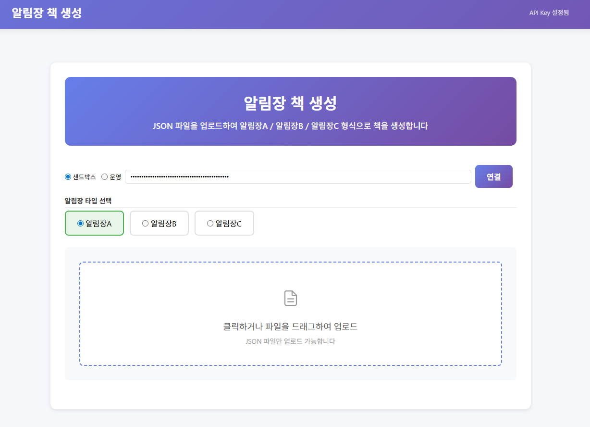

# kidsDailyBook-demo — 알림장 책 생성

알림장 A / B / C 타입의 책을 생성하는 웹앱입니다.
JSON 데이터를 업로드하거나, 웹에서 직접 입력하여 알림장 포토북을 만들 수 있습니다.



> 이 demo는 **3-tier 구조**로 동작합니다. 브라우저는 Sweetbook API를 직접 부르지 않고,
> Sweetbook SDK와 API Key는 이 demo의 백엔드(`server.js`) 프로세스 안에만 존재합니다.
> 백엔드가 노출하는 좁은 REST(`/api/*`)만 프론트가 호출합니다.

## 구조

```
 브라우저 (index.html, app.js, book-builder.js)
        │  fetch('/api/...')   ← backend-client.js가 감싼 래퍼
        ▼
 이 demo 서버 (server.js, bookprintapi SDK 소유)
        │  Sweetbook API Key (서버 env)
        ▼
 Sweetbook API
```

| 파일 | 역할 |
|---|---|
| `index.html`, `style.css` | 마크업 / 스타일 |
| `app.js` | UI 이벤트, 책 생성 플로우 |
| `book-builder.js` | entries 변환, 파라미터 빌더 (A/B/C 타입별) |
| `backend-client.js` | 브라우저→백엔드 /api/* 얇은 래퍼 (SDK 아님) |
| `alrimjang-config.js` | 템플릿 UID, 월별 색상/아이콘, 그래픽 리소스 |
| `server.js` | **백엔드**. `bookprintapi` SDK로 Sweetbook 호출. /api/* 노출 |
| `.env` | 서버 전용 설정 (API Key, 환경) |
| `알림장A/`, `알림장B/`, `알림장C/` | 템플릿 CSV + 샘플 JSON |

## 실행

### 0. 클론

```bash
git clone https://github.com/sweet-book/kidsDailyBook-demo.git
cd kidsDailyBook-demo
```

특정 릴리스를 받으려면: `git clone -b v0.2.0 ...` 또는 [Releases](https://github.com/sweet-book/kidsDailyBook-demo/releases)에서 tarball 다운로드.

### 1. 설정

```bash
cp .env.example .env
```

`.env`:

```ini
SWEETBOOK_ENV=sandbox
SWEETBOOK_API_KEY=sk_test_xxxxx
PORT=8080
```

### 2. 의존성 설치

```bash
npm install
```

SDK는 npm 레지스트리가 아니라 **GitHub 태그**에서 설치됩니다 (`package.json` 참고).

### 3. 실행

```bash
npm start
```

접속: http://localhost:8080

## 백엔드가 노출하는 REST 엔드포인트

| 메서드 | 경로 | 설명 |
|---|---|---|
| GET | `/api/env` | 서버 환경(sandbox/live) 반환 |
| POST | `/api/books` | 책 생성 |
| POST | `/api/books/:uid/cover` | 표지 생성 |
| POST | `/api/books/:uid/contents` | 내지 1장 삽입 |
| POST | `/api/books/:uid/finalize` | 책 최종화 |

## 스모크 테스트

```bash
npm start            # 터미널 1
npm run smoke        # 터미널 2 — sandbox에서만
```

## 사용법

### JSON 데이터로 생성

1. 브라우저에서 http://localhost:8080 접속
2. 알림장 타입 선택 (A / B / C)
3. **JSON 파일 업로드** 모드에서 샘플 데이터 업로드:
   - `알림장A/samples/알림장A_이안.json` — 알림장A 샘플 (실제 데이터)
   - `알림장B/samples/알림장B_이안.json` — 알림장B 샘플
   - `알림장C/samples/알림장C_이안.json` — 알림장C 샘플
4. 표지/발행면 정보가 자동 입력됨 → 필요시 수정
5. **알림장 책 생성하기** 클릭

### 직접 입력으로 생성

1. **직접 입력** 모드로 전환
2. 날짜, 날씨, 식사량, 낮잠, 선생님 코멘트 등 입력
3. 사진 파일 선택 (여러 장 가능)
4. **항목 추가** → 원하는 만큼 반복
5. 표지 사진 선택 (선택사항)
6. **알림장 책 생성하기** 클릭

### JSON 데이터 형식

```json
{
  "title": "이안이의 성장 스토리북",
  "cover": {
    "childName": "이안이",
    "schoolName": "스위트어린이집",
    "volumeLabel": "Vol.1",
    "periodText": "2026년 1월 ~ 2026년 4월",
    "coverPhoto": "https://..."
  },
  "publish": {
    "title": "이안이의 성장 스토리북",
    "publishDate": "2026년 3월 6일",
    "author": "김수진",
    "hashtags": "#포토북은 #역시 #스위트북"
  },
  "entries": [
    { "type": "ganji", "year": 2026, "month": 1 },
    {
      "type": "naeji", "year": 2026, "month": 1,
      "day_data": {
        "date": "6일", "dayOfWeek": "화",
        "weather": "맑음", "meal": "정량", "nap": "2시간",
        "teacherComment": "오늘 창의 활동에서...",
        "parentComment": "집에서도 잘 지내고 있어요",
        "photos": ["https://..."]
      }
    }
  ]
}
```

## 샘플 데이터

| 타입 | 샘플 | 설명 |
|------|------|------|
| 알림장A | [알림장A_이안.json](알림장A/samples/알림장A_이안.json) | 4개월 67 entries, 월별 색상 라인 시안 |
| 알림장B | [알림장B_이안.json](알림장B/samples/알림장B_이안.json) | 4개월 54 entries, 월별 캐릭터 시안 |
| 알림장C | [알림장C_이안.json](알림장C/samples/알림장C_이안.json) | 4개월 74 entries, 월별 풍선 아이콘 시안 |

## 커스터마이징

이 데모를 자신의 서비스에 맞게 수정하려면:

| 파일 | 수정 내용 |
|------|----------|
| `alrimjang-config.js` | 템플릿 UID 변경, 월별 색상/아이콘 수정 |
| `book-builder.js` | 파라미터 빌더 수정, entries 변환 로직 변경 |
| `app.js` | UI 흐름 변경, 직접 입력 폼 필드 추가/제거 |
| `server.js` | 새 백엔드 엔드포인트 추가 |
| `.env` | API 키, 환경 설정 |

### 자신의 데이터 형식 적용

1. `book-builder.js`의 `buildEntries()` 함수에서 dataItems를 entries 배열로 변환하는 로직을 수정합니다.
2. `alrimjang-config.js`에서 자신의 템플릿 UID를 등록합니다.
3. 필요시 `app.js`의 `handleFile()`에서 JSON 파싱/검증 로직을 수정합니다.

## 관련 레포

- [sweet-book/bookprintapi-nodejs-sdk](https://github.com/sweet-book/bookprintapi-nodejs-sdk) — 이 demo의 `server.js`가 사용하는 SDK
